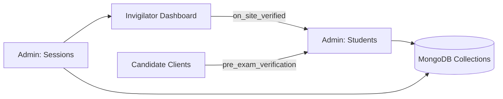

# Admin Dashboard — Exam Operations, Student & Session Management

## Purpose & Audience
- Purpose: Central control plane for exam administrators to manage exam blueprints, question bank ingestion, AI generation pipelines, registered students, sessions allocation, invigilator assignments, resiliency monitoring, and audit trails.
- Audience: System Admins, Exam Managers, Scheduling Coordinators, Security Officers, DevOps Engineers.

## New Top-Level Requirements (Student & Session Management)
- Registered Students management: upload, search, verify identity status, assign session, revoke assignment.
- Sessions management: create sessions, assign centers, schedule times, allocate capacity; view students assigned and assigned invigilator.
- Assignment rules enforcement:
  - A student can be in only one session per exam cycle.
  - There can be many sessions per city/center based on capacity and availability.
  - Every session must have one Senior Invigilator assigned.
  - A Senior Invigilator cannot be assigned to two consecutive sessions (consecutive by scheduled time at the same center or in the global session ordering depending on policy).
- Identity verification states tracked: `pre_exam_remote_verified`, `on_site_verified`, `photo_match_score`, `id_document_hash`.

## UI: Student Management section (new)
- Location: `Admin -> Students` in sidebar.
- Primary features:
  - Master student table with columns: `roll_number`, `full_name`, `email`, `phone`, `verified_pre_exam`, `verified_on_site`, `session_id`, `terminal_id`, `status` (active/blocked), `last_seen`.
  - Bulk import & dedupe pipeline for CSV/JSON; validation report and preview before commit.
  - Identity verification pane: display ID image, liveness snapshot, automated face-match score (0–100), and manual accept/reject.
  - Assign/Unassign session modal: shows available sessions (capacity left) per city/center and enforces "one session per student" rule.
  - Audit history: all assignment changes and verification events with timestamp and operator.

### Account & Authentication Controls

- Bulk account generation: Admins can generate student accounts during import or on-demand. The generator uses `reg_no` as `username` and a temporary password computed from the student's name and birth year (first 4 letters of name + birth year). Temporary accounts are flagged `must_change_password`.
- Admin controls:
  - `Generate Accounts` (bulk) — runs server-side job, writes `password_hash` and issues secure activation links (expires configurable, default 24h).
  - `Regenerate Temporary Password` — invalidates prior token, records audit, and optionally sends SMS OTP.
  - `Force Reset` — admin-initiated reset with required `reason` and 2FA.
- Security requirements for the auth system:
  - Store only salted password hashes (`argon2` preferred) and maintain `password_set_at` and `must_change_password` flags.
  - Enforce password change on first login and strong password policy after reset.
  - Log authentication events to `auth_logs` with IP, device id, and actor.
  - Provide an endpoint `POST /admin/students/{id}/generate-account` for generating credentials and audit trail.

## UI: Sessions Management section (new)
- Location: `Admin -> Sessions`.
- Primary features:
  - Sessions list: `session_id`, `exam_code`, `center_id`, `room_id`, `start_time`, `end_time`, `capacity`, `assigned_count`, `senior_invigilator_id`, `status`.
  - Session detail view: roster of assigned students (with search), invigilator assignment controls, seat map/terminal mapping, session logs (start/stop events), and master payload hash.
  - Capacity & Conflict checks when creating sessions (overlapping times in same room or instructor conflicts).
  - Batch assign students to session via filters (e.g., by city, preference, or manual selection).

## Invigilator Assignment Rules & UI Enforcement
- Senior Invigilator assignment widget shows candidate invigilators with recent duty timeline.
- System enforces rule: no invigilator may be assigned to two consecutive sessions. Enforcement algorithm:
  1. Sessions are ordered by `start_time` per center (or globally if required).
  2. When assigning Invigilator X to Session S, check previous and next sessions in the ordering for same invigilator. If assigned, block and surface conflict with suggested alternate invigilators.
  3. Provide an "override" flow requiring 2FA and audit comment if exception allowed.
- Visual indicator on session list if invigilator violates the consecutive-session rule (red badge).

## Data Model Mapping (summary)
- `students` → maps to `users` / candidate profile in MongoDB with extra verification fields.
- `sessions` → maps to `generated_sessions` / scheduling collection.
- `assignments` → mapping collection `session_assignments` linking `student_id` → `session_id` → `terminal_id`.
- `invigilators` → `users` with role `INVIGILATOR`; duty logs in `invigilator_roster` collection.

## Admin UI Layout — Additions
- On the Admin Workspace main body add two tabs: `Students` and `Sessions` (primary), each with a split workspace: table/list + detail pane.
- Right contextual rail shows quick actions: send pre-exam verification request, generate seat map, export roster, trigger session start.

## Cross-Dashboard Interactions (updated)
- When an Admin assigns students to a session, the `Invigilator Dashboard` receives real-time roster updates and seat map.
- Invigilator actions (e.g., marking on-site verification complete) update the student record and surface in Admin `Audit Logs`.
- Student verification status flows to the `Candidate Dashboard` (e.g., lock/unlock access) via server-side gating APIs.

## APIs & Operations (brief)
- `GET /admin/students?query=...` — list students
- `POST /admin/students/import` — bulk import
- `POST /admin/students/{id}/assign-session` — assign a session (validates constraints)
- `GET /admin/sessions` — list sessions
- `POST /admin/sessions` — create session
- `POST /admin/sessions/{id}/assign-invigilator` — assign invigilator (validates consecutive-session rule)

## Security & Permissions
- Scheduling/assignment operations require `Scheduling Manager` role.
- Overriding consecutive-invigilator conflict requires `Senior Admin` plus 2FA and is logged in `audit_logs` with reason.

---
*File: `Markdown/dashboards/Admin_Dashboard_UI_Spec.md` created.*
